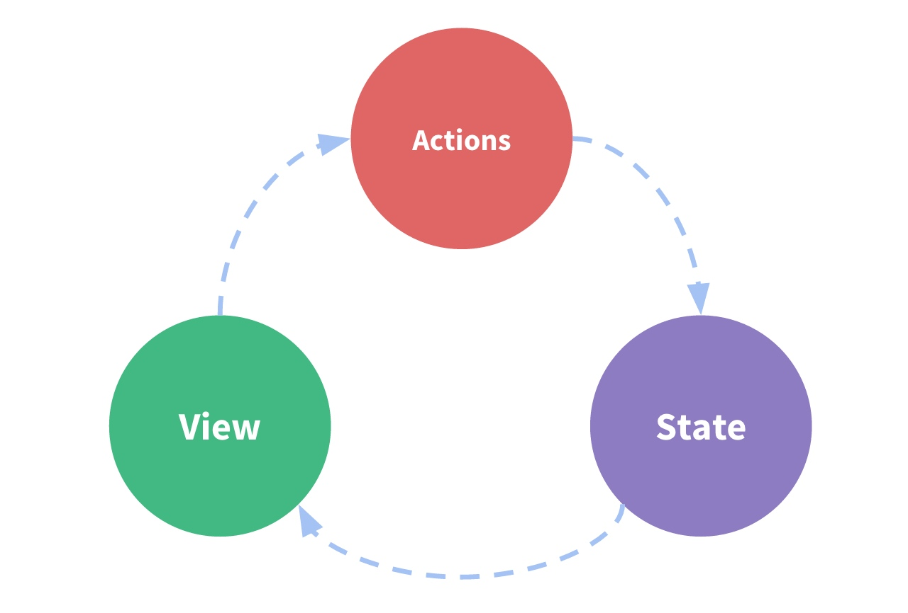

# 从RxSwift到Combine

[TOC]

## Combine简介
`Combine` 框架提供了一个函数响应式 Swift API，用于处理随时间变化的值。这些值可以代表多种异步事件。`Combine`用**发布者**发送随时间变化的值，而**订阅者**从发布者接收这些值进行处理。

通过采用`Combine`，您可以集中事件处理代码并消除嵌套闭包和基于约定的回调（`delegate`、`Notification`）等麻烦的技术，从而使代码更易于阅读和维护。

以上是Apple官方原话，用一句话概括就是 *“一个随时间处理数据的声明式的 Swift API。”* 即`Swift`的响应式异步编程框架。

* 响应式（观察者模式）
* 适用于用户交互（
* 闭源
* Apple提供系统级支持, iOS 13以上

当中的概念、角色、特征与其他响应式框架别无二致（RxSwift），因此对照学习可以事半功倍。

## 角色

【核心角色】

Combine | RxSwift
---|---
Publisher | Observable
Operator | Operator
Subscriber | Observer

关系图：


【其他角色】

Combine | RxSwift
---|---
Scheduler |  Scheduler
Subject | *SubjectType
Cancellable | Disposable

### 订阅链路与事件


> 通过prin()打印订阅链路流程，可以看到有request unlimited语句，对应流程3.这里其实是一个back pressure（背压、控流）。


【事件】

Combine | RxSwift
---|---
receive(value) | onNext(value)
receive finished | onCompleted
failure | onError


### Publisher

```swift
public protocol Publisher<Output, Failure> {
    associatedtype Output
    associatedtype Failure : Error
    func receive<S>(subscriber: S) where S : Subscriber, Self.Failure == S.Failure, Self.Output == S.Input
}
```

> `S : Subscriber, Self.Failure == S.Failure, Self.Output == S.Input`表明了二者类型匹配的核心

【创建Publisher】

```swift
Empty<Any, Never>()
Just("string")
```

【Foundation内置的Publisher】

```swift
let dataTask = URLSession.shared.dataTaskPublisher(for: URL(string: "https://www.baidu.com")!)
    .share()
    
 NotificationCenter.default.publisher(for: Notification.Name )
// Publisher.Sequence<Array<Int>, Never>
[1,2,3,4].publisher 
```


### Operator
`operator`是`Publisher`提供的一系列[方法](https://developer.apple.com/documentation/combine/publisher)

【命名相同的操作符】

功能相似或一致。

Combine | RxSwift
---|---
map | -
filter | -
compactMap | -
flatMap | -
merge | -
zip | -
...|...

【不同命名的操作符】

功能也相似。

Combine | RxSwift
---|---
removeDuplicates | distinctUntilChanged
sink | subscribe
assign(to:) | bind(to:)
...|...

### Subscriber

```swift 
public protocol Subscriber<Input, Failure> : CustomCombineIdentifierConvertible {
    associatedtype Input
    associatedtype Failure : Error
    func receive(subscription: Subscription)
    func receive(_ input: Self.Input) -> Subscribers.Demand
    func receive(completion: Subscribers.Completion<Self.Failure>)
}
```

【Sink】

通常情况下，我们可以使用`sink`订阅`Publisher`。

```swift
let publisher = Just(10)
print("开始订阅")
publisher.sink { completion in
    print(completion)
} receiveValue: { val in
    print(val)
}
```

【Assign】

`assign`有点类似`RxSwift`中的`bind`方法。`assign`接受一个`class`对象和`KeyPath`参数，要求`KeyPath`满足`ReferenceWritableKeyPath`协议。

另一个版本是接收一个`Published`。

```swift
class Person {
    var name: String?
}

let person = Person()

Just("xiaoming").assign(to: \.name, on: person)   

// 另一个版本
class Dog: ObservableObject {
    @Published var name = ""
}

let dog = Dog()

Just("dahuang").assign(to: &dog.$name) 
```

> Swift UI 中`ObservableObject`只能由`class`实现。

【类型嵌套与消除】

由于Apple的泛型设计方式用的类型嵌套，几个操作符之后，最终Operator出来的Publisher类型将变得非常复杂。

```swift
var val = 1
let publisher = CurrentValueSubject<Int, Never>(val)
    .map {  $0 % 4 }
    .flatMap { val in
        Just(["a", "b", "c", "d"][val])
    }
print(result.self)
// Publisher.FlatMap<Just<String>, Map<CurrentValueSubject<Int, Never>, Int>>
```

而我们通常最终更关心Publisher.Output的类型。因此`Apple`提供了`AnyPublisher`类型和`.eraseToAnyPublisher`方法。

```swift
let pub: AnyPublisher<Int, Never> = publisher.eraseToAnyPublisher()
```

【错误类型转换】

同样的，`Publisher.Failure`和`Subscriber.Failure`类型也需要一致。当不一致时，我们可以通过`mapError`操作符进行转换。

```swift
var publisher: AnyPublisher<Int, TestError>

publisher = Fail<Int, SampleError>(error: .sampleError("示例错误"))
    .mapError { sampleError in
        switch sampleError {
        case .sampleError(let desc):
            return TestError.failCase(desc)
        }
    }
    .eraseToAnyPublisher()
```

> 很自然地，`map`转换`receive`的`value`；`mapError`转换`receive`的`Failure`。
> `Never`表示不会收到错误事件。


### 错误处理

由上可知，`Failure`的类型就是系统的`Error`类型，订阅链上游可通过带有`try`前缀的操作符进行`throw`错误事件来终止订阅。

相对地，错误可使用`replaceError`替换为指定值，订阅链随即终止；另外，还可以`catch`操作符桥接到新的`Publisher`，原来的`Publisher`后面的元素被忽略。

```swift
["1", "0", "O" "8"].publisher
    .tryMap { s -> Int in
        guard let val = Int(s) else {
            throw SampleError.sampleError
        }
        return val
	 }
    .replaceError(with: -999) // catchAndReturn
    
    
["1", "0", "O", "8"].publisher
.tryMap { s -> Int in
    guard let val = Int(s) else {
        throw SampleError.sampleError
    }
    return val
}
.catch { _ in
    Just(-1)
}
```

## 特殊角色

### Subject

`Combine`中的`Subject`和`RxSwift`中的`Subject`功能类似，提供了直接从外部发送事件的入口，亦是命令式到响应式之间的桥梁。

```swift
public protocol Subject<Output, Failure> : AnyObject, Publisher {
    func send(_ value: Self.Output)
    func send(completion: Subscribers.Completion<Self.Failure>)
    func send(subscription: Subscription)
}
```

> 略有不同的是，`RxSwift`的on方法在具体实现类声明。

同样，`Combine`也提供了便捷使用类，在与`RxSwift`对应功能类如下表所示。`PassthroughSubject`仅转发值给`Subscriber`或`Publisher`，而`CurrentValueSubject`拥有记录上一次值的功能。

Combine | RxSwift
---|---
Subject | SubjectType
PassthroughSubject | PublishSubject
CurrentValueSubject | BehaviorSubject


### Scheduler

`Scheduler`同`RxSwift`中的`Scheduler`角色一致，主要明显订阅链的发送或接收动作在哪个线程。

Combine | RxSwift
---|---
Scheduler | Scheduler
DispatchQueue.main |  MainScheduler.instace
RunLoop.main | -
throttle | throttle
debounce | debounce

* `.receive(on: Scheduler)`
* `.subscribe(on: Scheduler)`

```swift
.throttle(for: .seconds(1), scheduler: DispatchQueue.main, latest: true)
```

### Future

`Future`提供了一个闭包初始化，只发送一个事件，要么带值结束，要么错误结束。

Combine | RxSwift
---|---
Future | Single

```swift
func request(url: URL, completion: @escaping (Data?, URLResponse?, Error?) -> Void) {
    URLSession.shared.dataTask(with: url) {
        data, response, error in
        completion(data, response, error)
    }.resume()
}

Future<(Data, URLResponse), Error> { promise in
    request(url: URL(string: "https://example.com")!) {
        data, response, error in
        if let data = data, let response = response {
            promise(.success((data, response)))
        } else {
            promise(.failure(error!))
        }
    }
}
```


### Timer

`Foundation`框架内置许多扩展方法来获取对应的`publisher`。

* 数组的扩展，类似`RxSwift`中的`of`;
* 通知的扩展，同Rx；
* `URLSession.shared.dataTaskPublisher`；

同样的，`Timer`也有。需要注意的是，`TimerPublisher`是一个`ConnectablePublisher`，需要明确调用`connect()`方法才会开始发送事件。

```swift
let timer = Timer.publish(every: 1, on: .main, in: .common)
timer.print().sink(receiveCompletion: { _ in }, receiveValue: { _ in })

timer.connect()

public protocol ConnectablePublisher<Output, Failure> : Publisher {
    func connect() -> Cancellable
}

```

### Cancellable与资源释放

上面的`timer.connect()`会返回一个`Cancellable`的对象，调用其`cancel`方法停止发送事件。

`RxSwift`订阅之后产生的是`Disposable`，而`Combine`订阅链产生的是`AnyCancellable`，作用与目的都一致——用于维护订阅链的生命周期。

相对的，维持引用方式也是相似的。

Combine | RxSwift
---|---
Cancellable | Disposable
AnyCancellable| -
store(in:) | dispose(by:)

```swift 
public protocol Cancellable {
    func cancel()
    public func store(in set: inout Set<AnyCancellable>)
}

final public class AnyCancellable : Cancellable, Hashable {}

```

> 注意，这里的`store(in set:)`是一个`inout`参数。


```swift
class A {
    private var bag = Set<AnyCancellable>()
    
    func bind() {
        Just(1)
            .filter { $0 % 10 }
            .sink(receiveCompletion: { _ in
                print("finished")
            }, receiveValue: { val in
                print(val)
            })
            .store(in: &bag)
    }
}
```

### @Published

在Swift UI中可用属性标记方式标注各种区动UI状态的数据。

* @State -- 值类型读写（拥有语义）
* @Binding -- 取初值读，写（非拥有语义）
* @StateObject -- 引用对象，用于复杂视图状态管理
* @ObservedObject -- 引用外部对象，用于复杂视图状态管理
* @EnvironmentObject -- 环境状态共享

`@StateObject`、`@ObservedObject`、`@EnvironmentObject`都需要遵守`ObservableObject`协议，该协议要求为`class`类型。其中，在`ObservableObject`中使用`@Publishe`标记属性用于绑定`UI`状态。

所有`@`标记的本质都是属性包装器，特别的，在`Swift UI`中用到的属性包装都是使用了`Combine`来封装绑定视图状态的数据。

```swift
@propertyWrapper public struct Published<Value> {

    public init(wrappedValue: Value)
.
    public init(initialValue: Value)

    public struct Publisher : Publisher {

        public typealias Output = Value
        public typealias Failure = Never
        public func receive<S>(subscriber: S) where Value == S.Input, S : Subscriber, S.Failure == Never
    }
    
    public var projectedValue: Published<Value>.Publisher { mutating get set }
}

// -- example --
class Wrapper {
    @Published var name: String = "unkonwn name"
}

let obj = Wrapper()
obj.name = "xiaoming"
obj.$name.map { $0.count }.print().sink(receiveValue: { _ in })

// PublishedSubject
// ...
```

通过`name`访问的是`wrappedValue`，同时这里提供了`init`，看起来和普通变量没有什么不同；而通过`$name`访问的是`projectedValue`，他是一个`Publisher`，亦称为投影属性。（在`State`中是`Binding`， 其他标记中会被转换为`Binding`）


> `Swift UI`中的UI状态读写绑定类型均为`Binding`。
> `@Published`投影属性从`print`实际打印出来的内部类型为`PublishedSubject`。

## *Redux For Swift

Redux的官方定义是*JavaScript应用程序的可预测状态容器*。

单向数据流核心概念：
* 视图（树）具有状态，并且**仅由状态更新**（也就不说不存在命令式更新）。
* 状态是不可变的类型。
* 交互由`Action`处理产生新的状态去更新视图。




为了达成上述目的，处理`Action`和`State`还引入了其他角色（严苛的模式）。

【状态机】


* 将整个应用视为状态机，维护状态，处理状态，显示状态。
* 所有状态保存在一个Store对象中。
* **View**不能操作`State`，只能通过发布`Action`来间接改存`Store`中的`State`。
* `Reducer`接收原有的`State`和`Action`进行处理，从而产生新的`State`。
* 新`State`会替换`Store`中的`State`，并驱动`View`刷新。


该架构的相关细节已在分享会上详细介绍，各角色代码组织方式可以参考登录项目示例。


> 一些开发者认为Redux的理念与`Swift UI`契合，所以也就引入了该模式。但是略有不同的是，除了额外定义的`Action`外，我们还支持`Binding`来传递`State`更新视图。


### 副作用

副作用（`side effect`）与`State`无关的操作，实际开发中经常又伴随修改状态间产生，在一些架构中用中间件（`middleware`）来完成。我们这里用另一个角色叫`Command`来完成，也就意味着`Reducer`不仅要生成新的`State`，还可能携带一个`Command`，使用`Command`完成副作用。

* 发起网络请求
* 写入缓存
* ...

## 相关链接

* [Operator API](https://developer.apple.com/documentation/combine/publisher)
* [redux.org](https://redux.js.org/introduction/getting-started)
